# KumoMTA UI - System Architecture Documentation

## Table of Contents

1. [System Architecture Overview](#system-architecture-overview)
2. [Authentication Flow](#authentication-flow)
3. [State Management Architecture](#state-management-architecture)
4. [Data Flow Diagram](#data-flow-diagram)
5. [Real-Time Data Architecture](#real-time-data-architecture)
6. [Queue Status State Machine](#queue-status-state-machine)
7. [Technology Stack](#technology-stack)

---

## System Architecture Overview

The KumoMTA UI follows a modern client-side architecture with clear separation of concerns between presentation, state management, and data fetching.


### Architecture Layers

#### 1. Presentation Layer (React Components)
- **Location**: `/src/components/`
- **Responsibility**: UI rendering, user interaction, visual feedback
- **Key Components**:
  - `Dashboard.tsx` - Real-time metrics display
  - `QueueManager.tsx` - Queue management interface
  - `ConfigEditor.tsx` - Server configuration
  - `LoginPage.tsx` - Authentication UI

#### 2. State Management Layer
- **Auth State**: Zustand store with localStorage persistence
- **Server State**: TanStack Query with automatic caching
- **Offline State**: IndexedDB for offline-first PWA support

#### 3. Business Logic Layer
- **Custom Hooks**: Encapsulate data fetching and business logic
- **API Services**: Centralized API communication

#### 4. Network Layer
- **Axios Client**: HTTP communication with interceptors
- **Request Interceptors**: Add authentication, CSRF tokens
- **Response Interceptors**: Error handling, token refresh, 401 redirect

#### 5. Backend Layer
- **KumoMTA Native API**: Email server operations (verified endpoints)
- **Custom Middleware**: Queue management, configuration (needs implementation)
- **PostgreSQL**: Audit logs and user management

---

## Authentication Flow

HTTP Basic Authentication with JWT-like token management using Zustand and localStorage persistence.


### Authentication Components

#### 1. Login Process
```typescript
// LoginPage.tsx - Line 34-60
const onSubmit = async (data: LoginFormData) => {
  // Create HTTP Basic Auth token
  const token = btoa(`${data.email}:${data.password}`);

  // Mock validation - REPLACE WITH REAL API CALL
  const user = {
    id: '1',
    email: data.email,
    name: data.email.split('@')[0],
    role: data.role,
  };

  login(user, token);
  navigate('/');
};
```

#### 2. Token Storage
```typescript
// authStore.ts - Line 16-51
export const useAuthStore = create<AuthState>()(
  persist(
    (set) => ({
      user: null,
      token: null,
      isAuthenticated: false,
      login: (user, token) => {
        set({ user, token, isAuthenticated: true });
      },
      logout: () => {
        set({ user: null, token: null, isAuthenticated: false });
      },
    }),
    {
      name: 'kumomta-auth-storage',
      storage: createJSONStorage(() => localStorage),
    }
  )
);
```

#### 3. Request Authentication
```typescript
// api.ts - Line 16-38
api.interceptors.request.use(
  config => {
    const token = useAuthStore.getState().token;

    if (token) {
      // KumoMTA expects HTTP Basic Auth
      config.headers.Authorization = `Basic ${token}`;
    }

    // Add CSRF token if available
    const csrfToken = document.querySelector('meta[name="csrf-token"]')?.content;
    if (csrfToken) {
      config.headers['X-CSRF-Token'] = csrfToken;
    }

    return config;
  }
);
```

#### 4. 401 Handling
```typescript
// api.ts - Line 41-66
api.interceptors.response.use(
  response => response,
  async error => {
    if (error.response?.status === 401) {
      useAuthStore.getState().logout();
      window.location.href = '/login';
    }
    return Promise.reject(error);
  }
);
```

### Security Features

1. **HTTP Basic Authentication**: Compatible with KumoMTA's native auth
2. **CSRF Protection**: Token injection from meta tag
3. **Automatic Logout**: On 401 responses
4. **Persistent Sessions**: localStorage with Zustand middleware
5. **Role-Based Access**: User roles stored in auth state

---

## State Management Architecture

A hybrid state management approach using Zustand for auth state and TanStack Query for server state.


### State Management Decision Tree


### State Management Patterns

#### 1. Zustand for Auth State
**Use When:**
- Managing authentication state
- Persisting user sessions
- Storing user profile data

```typescript
// Usage Example
const { user, token, isAuthenticated, login, logout } = useAuthStore();
```

#### 2. TanStack Query for Server State
**Use When:**
- Fetching data from API
- Need automatic caching
- Want refetch/retry logic
- Need optimistic updates

```typescript
// Usage Example - useKumoMTA.ts
export const useKumoMetrics = (refetchInterval = 5000) => {
  return useQuery({
    queryKey: ['kumomta-metrics'],
    queryFn: async () => {
      const response = await apiService.kumomta.getMetrics();
      return response.data;
    },
    refetchInterval,
    retry: 3,
    staleTime: 3000,
  });
};
```

#### 3. IndexedDB for Offline Storage
**Use When:**
- Offline-first PWA features
- Storing large datasets
- Queuing offline requests
- Caching dashboard data

```typescript
// Usage Example - offlineStorage.ts
await offlineStorage.setItem('DASHBOARD', 'metrics', data, 30);
const cached = await offlineStorage.getItem('DASHBOARD', 'metrics');
```

#### 4. React useState for UI State
**Use When:**
- Component-specific state
- No need for persistence
- Simple toggle states
- Form inputs (with react-hook-form)

```typescript
// Usage Example
const [isModalOpen, setIsModalOpen] = useState(false);
```

### Query Configuration

```typescript
// App.tsx - Line 18-28
const queryClient = new QueryClient({
  defaultOptions: {
    queries: {
      retry: 3,
      retryDelay: (attemptIndex) => Math.min(1000 * 2 ** attemptIndex, 30000),
      staleTime: 5000,      // Data fresh for 5 seconds
      gcTime: 300000,       // Cache for 5 minutes
      refetchOnWindowFocus: false,
    },
  },
});
```

---

## Data Flow Diagram

Complete request/response flow from UI component to backend and back.


### Data Flow Layers

#### 1. Component Layer
- Triggers data requests via hooks
- Receives loading/error/success states
- Renders UI based on data state

#### 2. Hook Layer
- Encapsulates business logic
- Manages TanStack Query operations
- Provides clean API to components

```typescript
// useKumoMTA.ts - Line 52-85
export const useQueueControl = () => {
  const queryClient = useQueryClient();

  const suspendQueue = useMutation({
    mutationFn: ({ domain, reason, duration }) =>
      apiService.kumomta.suspendQueue(domain, reason, duration),
    onSuccess: () => {
      queryClient.invalidateQueries({ queryKey: ['kumomta-scheduled-queue'] });
      queryClient.invalidateQueries({ queryKey: ['kumomta-metrics'] });
    },
  });

  return { suspendQueue };
};
```

#### 3. Cache Layer
- Stores responses with stale-while-revalidate strategy
- Manages cache invalidation
- Handles refetch intervals

#### 4. API Service Layer
- Centralized endpoint definitions
- Type-safe request/response
- Consistent error handling

```typescript
// api.ts - Line 69-146
export const apiService = {
  kumomta: {
    getMetrics: () => api.get('/metrics.json'),
    suspendQueue: (domain, reason, duration) =>
      api.post('/api/admin/suspend/v1', { domain, reason, duration }),
  },
};
```

#### 5. Network Layer
- Axios instance with base configuration
- Request/response interceptors
- Authentication injection

#### 6. Error Handling Layer
- Response interceptor catches errors
- Maps status codes to actions
- Provides user feedback via toasts

---

## Real-Time Data Architecture

Dual strategy: HTTP polling (current) and WebSocket support (implemented but optional).


### Polling Strategy (Current Implementation)


### WebSocket Strategy (Available but Optional)


### Real-Time Implementation

#### HTTP Polling
```typescript
// useKumoMTA.ts - Line 7-18
export const useKumoMetrics = (refetchInterval = 5000) => {
  return useQuery({
    queryKey: ['kumomta-metrics'],
    queryFn: async () => {
      const response = await apiService.kumomta.getMetrics();
      return response.data;
    },
    refetchInterval,  // Poll every 5 seconds
    retry: 3,
    staleTime: 3000,
  });
};
```

#### WebSocket Connection
```typescript
// useWebSocket.ts - Line 31-129
export const useWebSocket = (options: UseWebSocketOptions) => {
  const connect = useCallback(() => {
    const ws = new WebSocket(url);

    ws.onopen = () => {
      setIsConnected(true);
      reconnectAttemptsRef.current = 0;
    };

    ws.onclose = () => {
      setIsConnected(false);

      // Auto-reconnect
      if (reconnectAttemptsRef.current < maxReconnectAttempts) {
        reconnectAttemptsRef.current++;
        setTimeout(connect, reconnectInterval);
      }
    };

    ws.onmessage = (event) => {
      const message = JSON.parse(event.data);
      setLastMessage(message);
      onMessage?.(message);
    };
  }, [url]);
};
```

### When to Use Each Strategy

| Feature | HTTP Polling | WebSocket |
|---------|-------------|-----------|
| **Latency** | 0-5 seconds | <100ms |
| **Server Load** | Higher | Lower |
| **Complexity** | Simple | Complex |
| **Reliability** | High | Moderate |
| **Offline Support** | Good | Poor |
| **Current Status** | ✅ Active | ⚠️ Available |

---

## Queue Status State Machine

Message lifecycle with 9 distinct states and valid transitions.

```mermaid
stateDiagram-v2
    [*] --> Queued: Message submitted

    Queued --> Scheduled: Message accepted
    Queued --> Failed: Validation error
    Queued --> Cancelled: User cancellation

    Scheduled --> Sending: Ready to send
    Scheduled --> Suspended: Queue suspended
    Scheduled --> Cancelled: User cancellation

    Sending --> Sent: Delivery success
    Sending --> Failed: Delivery error
    Sending --> Delayed: Temp failure / Retry

    Sent --> [*]: Final state

    Failed --> Bounced: Permanent failure
    Failed --> Queued: Manual retry

    Bounced --> [*]: Final state

    Delayed --> Scheduled: Retry scheduled
    Delayed --> Failed: Max retries

    Suspended --> Scheduled: Resume queue
    Suspended --> Cancelled: User cancellation

    Cancelled --> [*]: Final state

    note right of Queued
        Initial state
        Message in queue
        Awaiting validation
    end note

    note right of Scheduled
        Validated message
        Waiting for send
        Time/rate limited
    end note

    note right of Sending
        Active delivery
        Connection open
        SMTP handshake
    end note

    note right of Sent
        ✅ Success
        Message delivered
        Final state
    end note

    note right of Failed
        ❌ Error occurred
        Delivery failed
        May retry
    end note

    note right of Bounced
        ⛔ Permanent failure
        No retry
        Final state
    end note

    note right of Delayed
        ⏱️ Temporary failure
        Will retry
        Exponential backoff
    end note

    note right of Suspended
        ⏸️ Queue paused
        Admin action
        Can resume
    end note

    note right of Cancelled
        🚫 User cancelled
        Removed from queue
        Final state
    end note
```



### State Descriptions

#### Active States (Can Transition)

1. **Queued** (`waiting`)
   - Message submitted to queue
   - Awaiting validation and scheduling
   - **Transitions to**: Scheduled, Failed, Cancelled

2. **Scheduled** (`waiting`)
   - Message validated and scheduled
   - Waiting for rate limits / time slots
   - **Transitions to**: Sending, Suspended, Cancelled

3. **Sending** (`in-progress`)
   - Active SMTP delivery in progress
   - Connection open to recipient server
   - **Transitions to**: Sent, Failed, Delayed

4. **Delayed** (`waiting`)
   - Temporary delivery failure (4xx SMTP code)
   - Will retry with exponential backoff
   - **Transitions to**: Scheduled, Failed

5. **Suspended** (`waiting`)
   - Queue manually suspended by admin
   - Message held until resume
   - **Transitions to**: Scheduled, Cancelled

#### Terminal States (No Further Transitions)

6. **Sent** (`completed`)
   - ✅ Message successfully delivered
   - Final successful state

7. **Failed** (`failed`)
   - ❌ Delivery failed (network/server error)
   - May be manually retried

8. **Bounced** (`failed`)
   - ⛔ Permanent delivery failure (5xx SMTP code)
   - Invalid recipient / domain
   - No retry possible

9. **Cancelled** (`cancelled`)
   - 🚫 User or admin cancelled message
   - Removed from queue

### Transition Triggers


### State Management in Code

```typescript
// queue.ts - Line 12-21
export interface QueueItem {
  id: string;
  status: 'waiting' | 'in-progress' | 'completed' | 'cancelled';
  // Maps to states:
  // waiting = Queued | Scheduled | Delayed | Suspended
  // in-progress = Sending
  // completed = Sent
  // cancelled = Cancelled | Failed | Bounced
}
```

---

## Technology Stack

### Frontend Technologies


### Key Dependencies

| Category | Library | Version | Purpose |
|----------|---------|---------|---------|
| **Framework** | React | 18.3 | UI library with concurrent features |
| **Language** | TypeScript | 5.5 | Type-safe development |
| **Build** | Vite | 5.4 | Fast build tool and dev server |
| **Routing** | React Router | 6.22 | Client-side routing |
| **State** | TanStack Query | 5.24 | Async state management |
| **State** | Zustand | 4.5 | Lightweight state store |
| **HTTP** | Axios | 1.6 | Promise-based HTTP client |
| **Forms** | React Hook Form | 7.50 | Performant form handling |
| **Styling** | TailwindCSS | 3.4 | Utility-first CSS |
| **Charts** | Chart.js | 4.4 | Data visualization |
| **Icons** | Lucide React | 0.344 | Icon library |
| **Testing** | Vitest | 1.6 | Unit testing framework |
| **E2E** | Playwright | 1.56 | End-to-end testing |
| **PWA** | Vite PWA | 1.1 | Progressive web app |

---

## Backend Requirements

### Custom Middleware Needed

The following features require custom backend middleware implementation:


### Implementation Roadmap

1. **API Gateway/Middleware Layer**
   - Express.js or FastAPI server
   - Sits between UI and KumoMTA
   - Handles authentication, authorization
   - Manages custom queue operations

2. **PostgreSQL Database**
   - User authentication and roles
   - Audit log persistence
   - Queue state management
   - Configuration storage

3. **Authentication Service**
   - Replace mock login with real validation
   - JWT or session-based auth
   - Role-based access control (RBAC)
   - Password hashing (bcrypt)

4. **Queue Management Service**
   - CRUD operations for queue items
   - Status transition validation
   - Filter and search implementation
   - CSV export generation

---

## Performance Optimizations

### Query Optimization

```typescript
// Retry with exponential backoff
retry: 3,
retryDelay: (attempt) => Math.min(1000 * 2 ** attempt, 30000),

// Smart caching
staleTime: 5000,    // Fresh for 5 seconds
gcTime: 300000,     // Cache for 5 minutes
refetchOnWindowFocus: false,
```

### Code Splitting

```typescript
// Vite automatically splits vendor bundles
{
  'react-vendor': ['react', 'react-dom', 'react-router-dom'],
  'query-vendor': ['@tanstack/react-query'],
  'chart-vendor': ['chart.js', 'react-chartjs-2'],
}
```

### Debouncing

```typescript
// useDebounce.ts - 300ms delay for search
const debouncedValue = useDebounce(searchQuery, 300);
```

---

## Security Considerations

1. **Authentication**: HTTP Basic Auth (replace with JWT in production)
2. **CSRF Protection**: Token injection in request headers
3. **401 Handling**: Automatic logout and redirect
4. **HTTPS**: Required in production
5. **Input Validation**: Client and server-side validation
6. **XSS Protection**: React automatically escapes content
7. **CORS**: Properly configured on backend

---

## Future Enhancements

1. **WebSocket Integration**: Switch from polling to real-time updates
2. **Advanced Caching**: Service Worker with Workbox
3. **Offline Queue**: Sync operations when back online
4. **Real-time Notifications**: Push notifications for critical events
5. **Advanced Analytics**: Historical trends and forecasting
6. **Multi-tenant Support**: Separate dashboards per organization
7. **API Rate Limiting**: Prevent abuse and ensure fair usage
