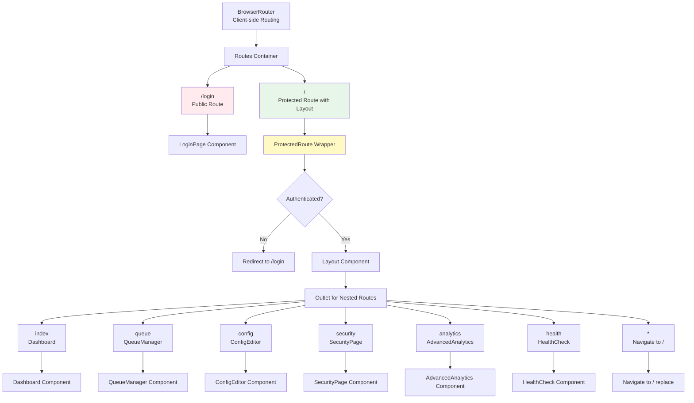
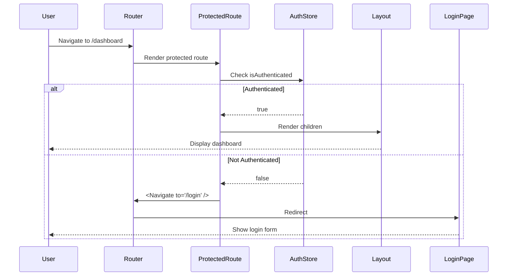
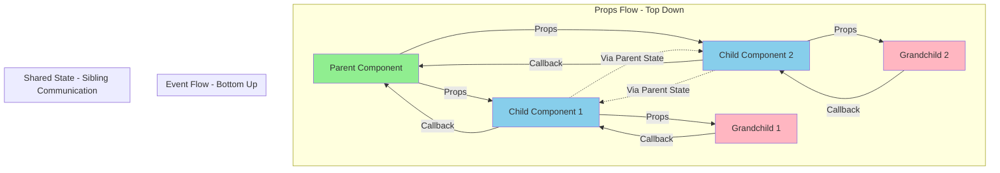
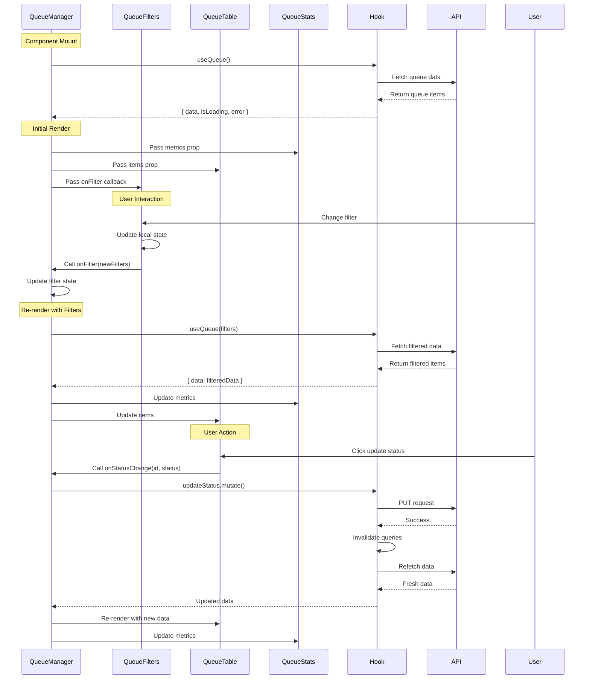
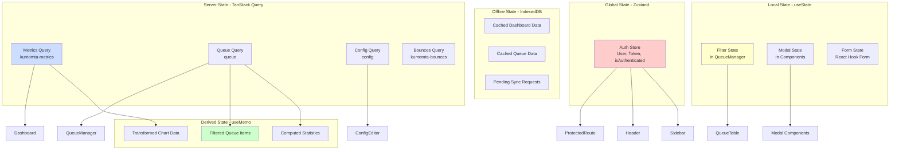
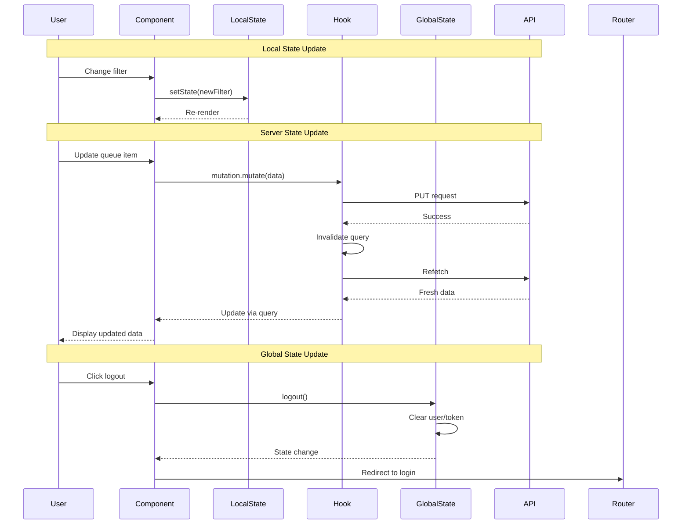
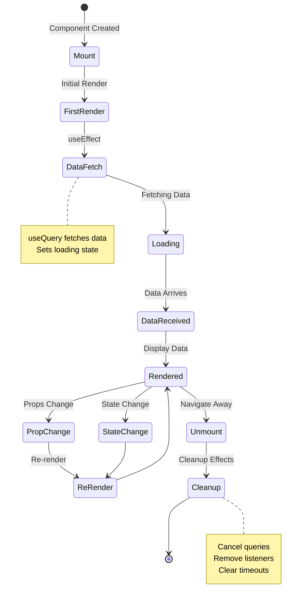

# Component Hierarchy Documentation

Complete component tree, data flow, routing structure, and shared state management.

## Table of Contents

1. [Component Tree Structure](#component-tree-structure)
2. [Routing Architecture](#routing-architecture)
3. [Data Flow Between Components](#data-flow-between-components)
4. [Shared State Management](#shared-state-management)
5. [Component Communication Patterns](#component-communication-patterns)

---

## Component Tree Structure

### Full Application Hierarchy

```mermaid
graph TB
    App[App.tsx<br/>Root Component]

    App --> ErrorBoundary[ErrorBoundary<br/>Error Handling]
    App --> QueryProvider[QueryClientProvider<br/>TanStack Query]
    App --> BrowserRouter[BrowserRouter<br/>React Router]

    ErrorBoundary --> Routes[Routes<br/>Route Definitions]

    Routes --> PublicRoute["/login"<br/>Public Route]
    Routes --> ProtectedRoutes["/"<br/>Protected Routes]

    PublicRoute --> LoginPage[LoginPage<br/>Authentication UI]

    ProtectedRoutes --> ProtectedRoute[ProtectedRoute<br/>Auth Guard]
    ProtectedRoute --> Layout[Layout<br/>App Shell]

    subgraph "PWA Components - Global"
        OfflineIndicator[OfflineIndicator<br/>Network Status]
        PWAInstallPrompt[PWAInstallPrompt<br/>Install Banner]
        UpdatePrompt[UpdatePrompt<br/>Update Notification]
    end

    App --> OfflineIndicator
    App --> PWAInstallPrompt
    App --> UpdatePrompt

    subgraph "Layout Components"
        Layout --> Sidebar[Sidebar<br/>Navigation Menu]
        Layout --> Header[Header<br/>Top Bar]
        Layout --> MainContent[Outlet<br/>Route Content]
        Layout --> ToastContainer[ToastContainer<br/>Notifications]
    end

    Header --> ThemeToggle[ThemeToggle<br/>Dark/Light Mode]
    Header --> UserMenu[UserMenu<br/>Profile/Logout]

    subgraph "Page Components - Routes"
        MainContent --> Dashboard["/"]
        MainContent --> QueueManager["/queue"]
        MainContent --> ConfigEditor["/config"]
        MainContent --> SecurityPage["/security"]
        MainContent --> AdvancedAnalytics["/analytics"]
        MainContent --> HealthCheck["/health"]
    end

    subgraph "Dashboard Page"
        Dashboard --> MetricsCards[MetricsCards<br/>KPIs]
        Dashboard --> ThroughputChart[ThroughputChart<br/>Chart.js]
        Dashboard --> RecentActivity[RecentActivity<br/>Activity Feed]
        Dashboard --> QuickActions[QuickActions<br/>Action Buttons]
    end

    subgraph "Queue Manager Page"
        QueueManager --> QueueFilters[QueueFilters<br/>Search & Filter]
        QueueManager --> QueueStats[QueueStats<br/>Statistics]
        QueueManager --> QueueTable[QueueTable<br/>Data Table]
        QueueManager --> VirtualQueueTable[VirtualQueueTable<br/>Virtualized Table]
        QueueManager --> QueueActions[QueueActions<br/>Bulk Actions]
        QueueManager --> ExportButton[ExportButton<br/>CSV Export]
    end

    QueueTable --> LoadingSkeleton[LoadingSkeleton<br/>Skeleton UI]
    QueueTable --> ErrorMessage[ErrorMessage<br/>Error State]

    subgraph "Config Editor Page"
        ConfigEditor --> ConfigSection[ConfigSection<br/>Section Wrapper]
        ConfigEditor --> CoreConfig[CoreConfig<br/>Server Settings]
        ConfigEditor --> IntegrationConfig[IntegrationConfig<br/>API/Webhook]
        ConfigEditor --> PerformanceConfig[PerformanceConfig<br/>Performance]
    end

    ConfigSection --> HelpTooltip[HelpTooltip<br/>Context Help]

    subgraph "Security Page"
        SecurityPage --> AuditLogViewer[AuditLogViewer<br/>Audit Logs]
        SecurityPage --> RoleManagement[RoleManagement<br/>RBAC]
        SecurityPage --> SessionManagement[SessionManagement<br/>Sessions]
    end

    AuditLogViewer --> AuditLogFilters[AuditLogFilters<br/>Log Filters]
    AuditLogViewer --> AuditLogTable[AuditLogTable<br/>Log Table]
    AuditLogViewer --> AuditLogTimeline[AuditLogTimeline<br/>Timeline View]
    AuditLogViewer --> AuditLogStats[AuditLogStats<br/>Statistics]
    AuditLogTable --> AuditEventDetails[AuditEventDetails<br/>Event Modal]

    RoleManagement --> RoleGuard[RoleGuard<br/>Permission Check]
    RoleManagement --> ProtectedAction[ProtectedAction<br/>Action Guard]
    RoleManagement --> RoleBadge[RoleBadge<br/>Role Display]

    subgraph "Analytics Page"
        AdvancedAnalytics --> TimeRangeSelector[TimeRangeSelector<br/>Date Picker]
        AdvancedAnalytics --> MetricCharts[MetricCharts<br/>Multiple Charts]
        AdvancedAnalytics --> ComparisonView[ComparisonView<br/>Compare Metrics]
        AdvancedAnalytics --> ExportAnalytics[ExportAnalytics<br/>PDF/CSV Export]
    end

    subgraph "Health Check Page"
        HealthCheck --> ServerStatus[ServerStatus<br/>Status Cards]
        HealthCheck --> ComponentHealth[ComponentHealth<br/>Component Status]
        HealthCheck --> SystemMetrics[SystemMetrics<br/>CPU/Memory]
    end

    subgraph "Shared Components"
        Toast[Toast<br/>Toast Message]
        HelpButton[HelpButton<br/>Help Icon]
        HelpPanel[HelpPanel<br/>Help Sidebar]
    end

    ToastContainer --> Toast

    style App fill:#e1f5ff
    style Layout fill:#fff4e1
    style Dashboard fill:#e8f5e9
    style QueueManager fill:#f3e5f5
    style ConfigEditor fill:#fff9c4
    style SecurityPage fill:#ffebee
    style AdvancedAnalytics fill:#e0f2f1
    style HealthCheck fill:#fce4ec
```



### Component Categories

#### 1. Root Level Components
- **App.tsx**: Application root, providers, routing
- **ErrorBoundary**: Catch React errors
- **QueryClientProvider**: TanStack Query setup

#### 2. Layout Components
- **Layout**: App shell with sidebar, header, main content
- **Sidebar**: Navigation menu
- **Header**: Top bar with theme toggle and user menu
- **ToastContainer**: Global toast notifications

#### 3. Page Components (Routes)
- **Dashboard**: Metrics overview and charts
- **QueueManager**: Queue management interface
- **ConfigEditor**: Server configuration
- **SecurityPage**: Security and audit logs
- **AdvancedAnalytics**: Analytics and reporting
- **HealthCheck**: System health monitoring
- **LoginPage**: Authentication form

#### 4. Feature Components
- **Queue**: QueueTable, QueueFilters, QueueStats
- **Config**: ConfigSection, CoreConfig, IntegrationConfig
- **Audit**: AuditLogViewer, AuditLogTable, AuditLogTimeline
- **Auth**: ProtectedRoute, RoleGuard, ProtectedAction

#### 5. Common/Shared Components
- **LoadingSkeleton**: Loading states
- **Toast**: Notification messages
- **ThemeToggle**: Dark/light mode switch
- **ExportButton**: CSV/PDF export
- **HelpTooltip**: Context-sensitive help

---

## Routing Architecture

### Route Structure with React Router v6



### Route Configuration

```typescript
// App.tsx - Line 40-58
<Routes>
  {/* Public Routes */}
  <Route path="/login" element={<LoginPage />} />

  {/* Protected Routes */}
  <Route path="/" element={
    <ProtectedRoute>
      <Layout />
    </ProtectedRoute>
  }>
    <Route index element={<Dashboard />} />
    <Route path="queue" element={<QueueManager />} />
    <Route path="config" element={<ConfigEditor />} />
    <Route path="security" element={<SecurityPage />} />
    <Route path="analytics" element={<AdvancedAnalytics />} />
    <Route path="health" element={<HealthCheck />} />
    <Route path="*" element={<Navigate to="/" replace />} />
  </Route>
</Routes>
```

### Protected Route Guard



### Route Navigation

```typescript
// Navigation from components
import { useNavigate } from 'react-router-dom';

const Component = () => {
  const navigate = useNavigate();

  const handleClick = () => {
    navigate('/queue');
  };
};
```

---

## Data Flow Between Components

### Parent-Child Data Flow



### Example: QueueManager Data Flow



### Data Flow Patterns

#### 1. Props Drilling (Simple)
```typescript
// QueueManager.tsx
const QueueManager = () => {
  const { data: items } = useQueue();
  const [filters, setFilters] = useState({});

  return (
    <>
      <QueueFilters onFilterChange={setFilters} />
      <QueueTable items={items} filters={filters} />
    </>
  );
};
```

#### 2. Render Props (Advanced)
```typescript
// Example: Render prop pattern
const DataProvider = ({ render }) => {
  const data = useKumoMetrics();
  return render(data);
};

// Usage
<DataProvider render={(data) => <Dashboard data={data} />} />
```

#### 3. Compound Components
```typescript
// Example: Compound component pattern
const Tabs = ({ children }) => {
  const [activeTab, setActiveTab] = useState(0);
  return (
    <TabsContext.Provider value={{ activeTab, setActiveTab }}>
      {children}
    </TabsContext.Provider>
  );
};

Tabs.Panel = ({ children, index }) => {
  const { activeTab } = useContext(TabsContext);
  return activeTab === index ? children : null;
};
```

---

## Shared State Management

### State Distribution Strategy



### State Access Patterns

#### Global Auth State
```typescript
// Any component can access auth state
import { useAuthStore } from '../store/authStore';

const Component = () => {
  const { user, isAuthenticated, logout } = useAuthStore();

  if (!isAuthenticated) return null;

  return (
    <div>
      Welcome, {user.name}
      <button onClick={logout}>Logout</button>
    </div>
  );
};
```

#### Server State via Hooks
```typescript
// Dashboard.tsx
import { useKumoMetrics } from '../hooks/useKumoMTA';

const Dashboard = () => {
  const { data: metrics, isLoading, error } = useKumoMetrics(5000);

  if (isLoading) return <LoadingSkeleton />;
  if (error) return <ErrorMessage error={error} />;

  return <MetricsDisplay data={metrics} />;
};
```

#### Local Component State
```typescript
// QueueManager.tsx
const QueueManager = () => {
  const [filters, setFilters] = useState<QueueFilter>({});
  const [selectedItems, setSelectedItems] = useState<string[]>([]);

  return (
    <>
      <QueueFilters filters={filters} onChange={setFilters} />
      <QueueTable
        selected={selectedItems}
        onSelect={setSelectedItems}
      />
    </>
  );
};
```

#### Derived State with useMemo
```typescript
// QueueTable.tsx
const QueueTable = ({ items, filters }) => {
  const filteredItems = useMemo(() => {
    return items.filter(item => {
      if (filters.status && item.status !== filters.status) return false;
      if (filters.searchQuery && !item.customerName.includes(filters.searchQuery)) return false;
      return true;
    });
  }, [items, filters]);

  return <Table data={filteredItems} />;
};
```

### State Update Patterns



---

## Component Communication Patterns

### Communication Strategies

```mermaid
graph TB
    subgraph "Parent-Child Communication"
        P1[Parent] -->|Props| C1[Child]
        C1 -->|Callbacks| P1
    end

    subgraph "Sibling Communication"
        S1[Sibling 1] -.->|Via Parent State| S2[Sibling 2]
        S2 -.->|Via Parent State| S1
    end

    subgraph "Global State Communication"
        G1[Component A] -->|Read/Write| Store[Global Store]
        Store -->|Subscribe| G2[Component B]
        G2 -->|Update| Store
    end

    subgraph "Context Communication"
        Provider[Context Provider] -->|Value| Consumer1[Consumer 1]
        Provider -->|Value| Consumer2[Consumer 2]
    end

    subgraph "Event Communication"
        E1[Component A] -->|Dispatch Event| Window[window]
        Window -->|Listen| E2[Component B]
    end

    style P1 fill:#90EE90
    style S1 fill:#87CEEB
    style S2 fill:#87CEEB
    style Store fill:#FFB6C1
    style Provider fill:#FFDAB9
```



### 1. Props and Callbacks

```typescript
// Parent component
const QueueManager = () => {
  const [filters, setFilters] = useState({});

  const handleFilterChange = (newFilters) => {
    setFilters(newFilters);
  };

  return (
    <QueueFilters
      filters={filters}
      onFilterChange={handleFilterChange}
    />
  );
};

// Child component
const QueueFilters = ({ filters, onFilterChange }) => {
  const handleChange = (e) => {
    onFilterChange({ ...filters, [e.target.name]: e.target.value });
  };

  return <input onChange={handleChange} />;
};
```

### 2. Context API

```typescript
// Create context
const ThemeContext = createContext();

// Provider
const App = () => {
  const [theme, setTheme] = useState('light');

  return (
    <ThemeContext.Provider value={{ theme, setTheme }}>
      <Layout />
    </ThemeContext.Provider>
  );
};

// Consumer
const ThemeToggle = () => {
  const { theme, setTheme } = useContext(ThemeContext);

  return (
    <button onClick={() => setTheme(theme === 'light' ? 'dark' : 'light')}>
      Toggle Theme
    </button>
  );
};
```

### 3. Custom Events

```typescript
// Dispatch event
const OfflineSync = () => {
  const notifyPendingRequests = (count) => {
    window.dispatchEvent(
      new CustomEvent('sw-pending-requests', {
        detail: { count },
      })
    );
  };
};

// Listen to event
const OfflineIndicator = () => {
  const [pendingCount, setPendingCount] = useState(0);

  useEffect(() => {
    const handlePendingCount = (e) => {
      setPendingCount(e.detail.count);
    };

    window.addEventListener('sw-pending-requests', handlePendingCount);

    return () => {
      window.removeEventListener('sw-pending-requests', handlePendingCount);
    };
  }, []);
};
```

### 4. Query Invalidation

```typescript
// Component A - Trigger mutation
const QueueManager = () => {
  const { mutate } = useQueueControl();

  const handleSuspend = (domain) => {
    mutate({ domain, reason: 'Maintenance' });
    // This invalidates queries and triggers refetch
  };
};

// Component B - Automatically updates
const Dashboard = () => {
  const { data } = useKumoMetrics();
  // This data automatically refreshes when queries invalidated
};
```

---

## Component Lifecycle Patterns

### Mount, Update, Unmount Flow



---

## Summary

### Component Best Practices

1. **Single Responsibility**: Each component has one clear purpose
2. **Prop Types**: Use TypeScript for type safety
3. **Error Boundaries**: Wrap error-prone components
4. **Loading States**: Always show skeleton UI while loading
5. **Memoization**: Use `useMemo` and `useCallback` for expensive operations
6. **Custom Hooks**: Extract reusable logic into hooks
7. **Consistent Naming**: Follow naming conventions

### State Management Guidelines

- **Local State**: Component-specific UI state
- **Global State**: Auth, theme, user preferences
- **Server State**: API data with TanStack Query
- **Form State**: React Hook Form for complex forms
- **Derived State**: Compute from existing state with `useMemo`

### Communication Guidelines

- **Props**: Parent to child
- **Callbacks**: Child to parent
- **Context**: Deep prop drilling
- **Global Store**: Cross-cutting concerns
- **Query Cache**: Server state sharing
- **Events**: Decoupled components
