# Data Flow Documentation

Complete request/response flow, error propagation, cache invalidation, and optimistic updates in the KumoMTA UI.

## Table of Contents

1. [Request/Response Flow](#requestresponse-flow)
2. [Error Propagation](#error-propagation)
3. [Cache Invalidation](#cache-invalidation)
4. [Optimistic Updates](#optimistic-updates)
5. [Offline Data Synchronization](#offline-data-synchronization)

---

## Request/Response Flow

### Complete Request Lifecycle

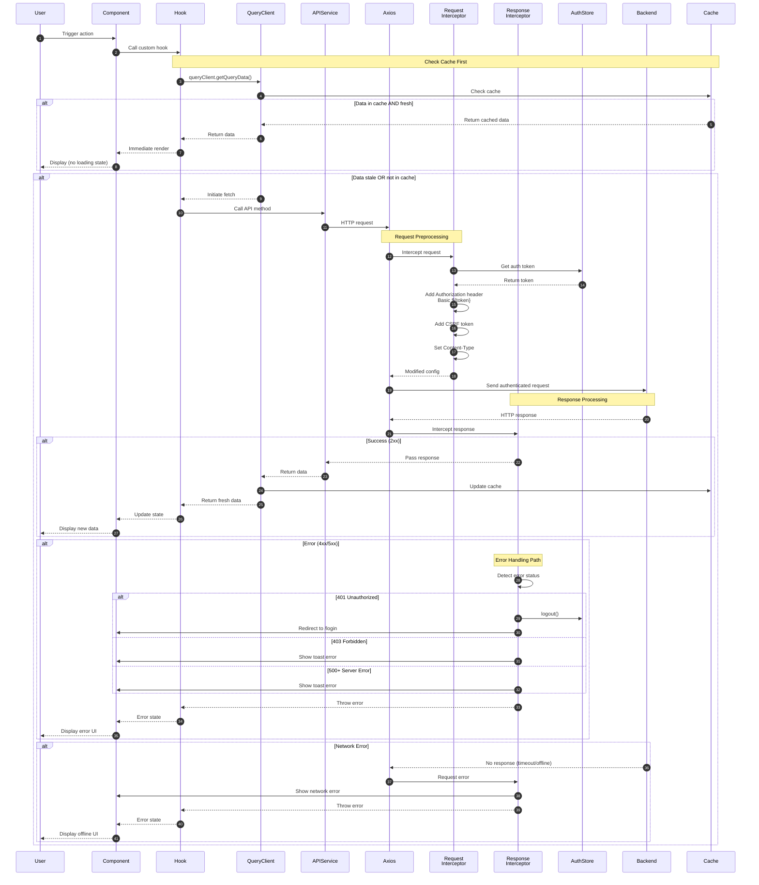

### Data Flow Layers

#### 1. Presentation Layer (Component)

**Input**: User interaction (click, form submit, page load)
**Output**: UI state updates, loading indicators, error messages

```typescript
// Dashboard.tsx - Example
const { data: metrics, isLoading, error } = useKumoMetrics(5000);

if (isLoading) return <LoadingSkeleton />;
if (error) return <ErrorMessage error={error} />;
return <MetricsDisplay data={metrics} />;
```

#### 2. Business Logic Layer (Custom Hook)

**Input**: Component requests for data/operations
**Output**: Typed data, loading states, error states

```typescript
// useKumoMTA.ts - Line 7-18
export const useKumoMetrics = (refetchInterval = 5000) => {
  return useQuery({
    queryKey: ['kumomta-metrics'],
    queryFn: async () => {
      const response = await apiService.kumomta.getMetrics();
      return response.data;
    },
    refetchInterval,
    retry: 3,
    staleTime: 3000,
  });
};
```

#### 3. Query Management Layer (TanStack Query)

**Input**: Query function, cache key, configuration
**Output**: Cached data or fresh fetch

- **Cache Check**: `queryClient.getQueryData(['kumomta-metrics'])`
- **Stale Check**: `Date.now() - lastFetch > staleTime`
- **Fetch Decision**: Stale or missing → trigger fetch

#### 4. API Service Layer

**Input**: Structured API calls with parameters
**Output**: Axios promises with typed responses

```typescript
// api.ts - Line 69-146
export const apiService = {
  kumomta: {
    getMetrics: () => api.get('/metrics.json'),
    suspendQueue: (domain, reason, duration) =>
      api.post('/api/admin/suspend/v1', { domain, reason, duration }),
  },
};
```

#### 5. HTTP Client Layer (Axios)

**Input**: HTTP method, URL, config, data
**Output**: HTTP response or error

```typescript
// api.ts - Line 6-13
const api = axios.create({
  baseURL: import.meta.env.VITE_API_URL || 'http://localhost:8000',
  timeout: 10000,
  headers: {
    'Content-Type': 'application/json',
  },
  withCredentials: true,
});
```

#### 6. Request Interceptor

**Input**: Axios config object
**Output**: Modified config with auth headers

```typescript
// api.ts - Line 16-38
api.interceptors.request.use(
  config => {
    const token = useAuthStore.getState().token;
    if (token) {
      config.headers.Authorization = `Basic ${token}`;
    }

    const csrfToken = document.querySelector('meta[name="csrf-token"]')?.content;
    if (csrfToken) {
      config.headers['X-CSRF-Token'] = csrfToken;
    }

    return config;
  }
);
```

#### 7. Response Interceptor

**Input**: Axios response or error
**Output**: Passed response or transformed error

```typescript
// api.ts - Line 41-66
api.interceptors.response.use(
  response => response,
  async error => {
    if (error.response?.status === 401) {
      useAuthStore.getState().logout();
      window.location.href = '/login';
    } else if (error.response?.status === 403) {
      throw new Error('Access forbidden');
    } else if (error.response?.status >= 500) {
      throw new Error('Server error');
    } else if (!error.response) {
      throw new Error('Network error');
    }
    return Promise.reject(error);
  }
);
```

---

## Error Propagation

### Error Types and Handling Strategies

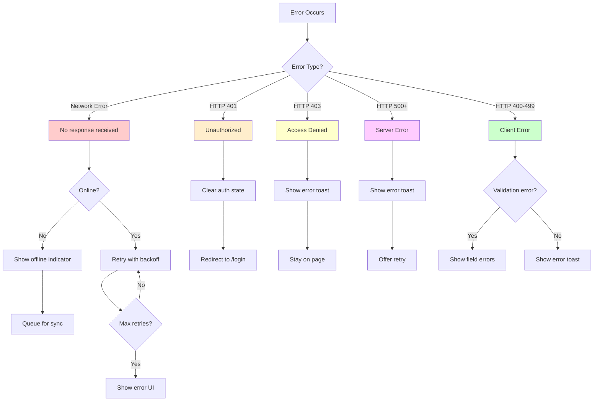

### Error Handling Flow

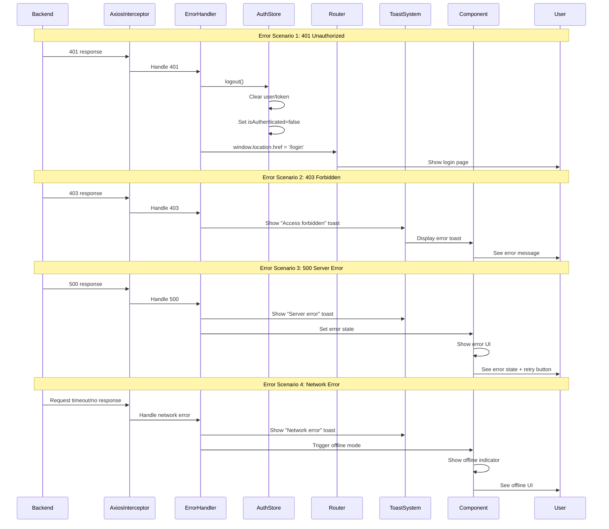

### Error Propagation Code

#### Interceptor Level
```typescript
// api.ts - Line 41-66
api.interceptors.response.use(
  response => response,
  async error => {
    if (error.response) {
      const status = error.response.status;

      if (status === 401) {
        useAuthStore.getState().logout();
        window.location.href = '/login';
      } else if (status === 403) {
        throw new Error('Access forbidden: Insufficient permissions');
      } else if (status >= 500) {
        throw new Error(`Server error: ${error.response.data?.message}`);
      }
    } else if (error.request) {
      throw new Error('Network error: Unable to connect to server');
    }

    return Promise.reject(error);
  }
);
```

#### Hook Level
```typescript
// Component receives error from hook
const { data, error, isError } = useKumoMetrics();

if (isError) {
  // TanStack Query provides error object
  return <ErrorMessage error={error} />;
}
```

#### Component Level
```typescript
// ErrorBoundary.tsx - Catches React errors
class ErrorBoundary extends React.Component {
  componentDidCatch(error, errorInfo) {
    console.error('Error caught by boundary:', error, errorInfo);
  }

  render() {
    if (this.state.hasError) {
      return <FallbackUI />;
    }
    return this.props.children;
  }
}
```

### Retry Strategy

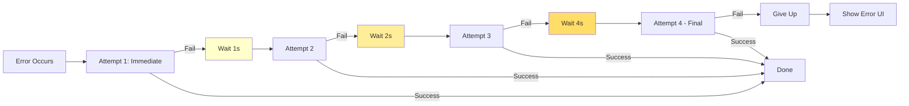

```typescript
// App.tsx - Line 18-28
const queryClient = new QueryClient({
  defaultOptions: {
    queries: {
      retry: 3,
      retryDelay: (attemptIndex) => Math.min(1000 * 2 ** attemptIndex, 30000),
      // Attempt 1: 1000ms
      // Attempt 2: 2000ms
      // Attempt 3: 4000ms
      // Max: 30000ms
    },
  },
});
```

---

## Cache Invalidation

### Cache Invalidation Strategies

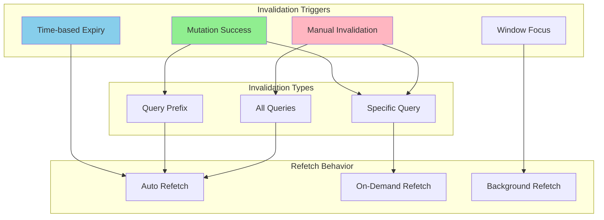

### Invalidation Flow

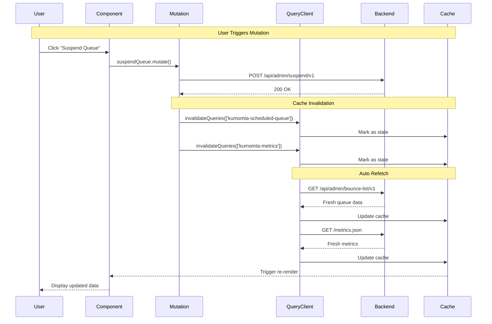

### Cache Invalidation Code

#### After Mutation Success
```typescript
// useKumoMTA.ts - Line 55-62
const suspendQueue = useMutation({
  mutationFn: ({ domain, reason, duration }) =>
    apiService.kumomta.suspendQueue(domain, reason, duration),
  onSuccess: () => {
    // Invalidate related queries
    queryClient.invalidateQueries({ queryKey: ['kumomta-scheduled-queue'] });
    queryClient.invalidateQueries({ queryKey: ['kumomta-metrics'] });
  },
});
```

#### Manual Invalidation
```typescript
// Manually invalidate from component
const queryClient = useQueryClient();

const handleRefresh = () => {
  queryClient.invalidateQueries({ queryKey: ['kumomta-metrics'] });
};
```

#### Time-based Invalidation
```typescript
// Automatic invalidation via staleTime
useQuery({
  queryKey: ['kumomta-metrics'],
  queryFn: fetchMetrics,
  staleTime: 5000,  // Data fresh for 5 seconds
  gcTime: 300000,   // Cache for 5 minutes
});
```

### Cache Lifecycle

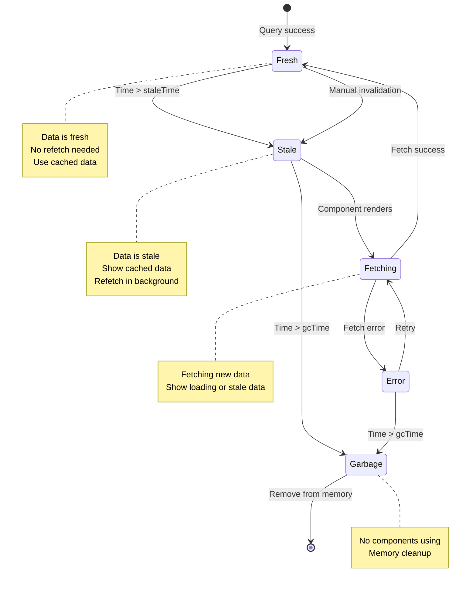

---

## Optimistic Updates

### Optimistic Update Flow

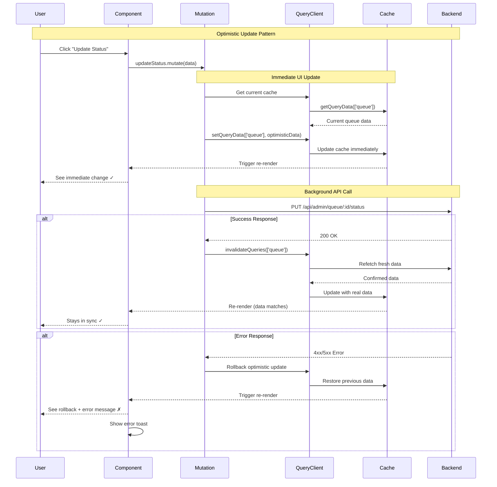

### Optimistic Update Implementation

#### Basic Pattern
```typescript
const updateEmailStatus = useMutation({
  mutationFn: (data: { id: string; status: string }) =>
    apiService.queue.updateStatus(data.id, data.status),

  // Step 1: Before mutation runs
  onMutate: async (newData) => {
    // Cancel outgoing refetches
    await queryClient.cancelQueries({ queryKey: ['queue'] });

    // Snapshot current state
    const previousQueue = queryClient.getQueryData(['queue']);

    // Optimistically update cache
    queryClient.setQueryData(['queue'], (old) => {
      return old.map(item =>
        item.id === newData.id
          ? { ...item, status: newData.status }
          : item
      );
    });

    // Return context for rollback
    return { previousQueue };
  },

  // Step 2: On error, rollback
  onError: (err, newData, context) => {
    queryClient.setQueryData(['queue'], context.previousQueue);
  },

  // Step 3: Always refetch after
  onSettled: () => {
    queryClient.invalidateQueries({ queryKey: ['queue'] });
  },
});
```

### Optimistic Update Strategies

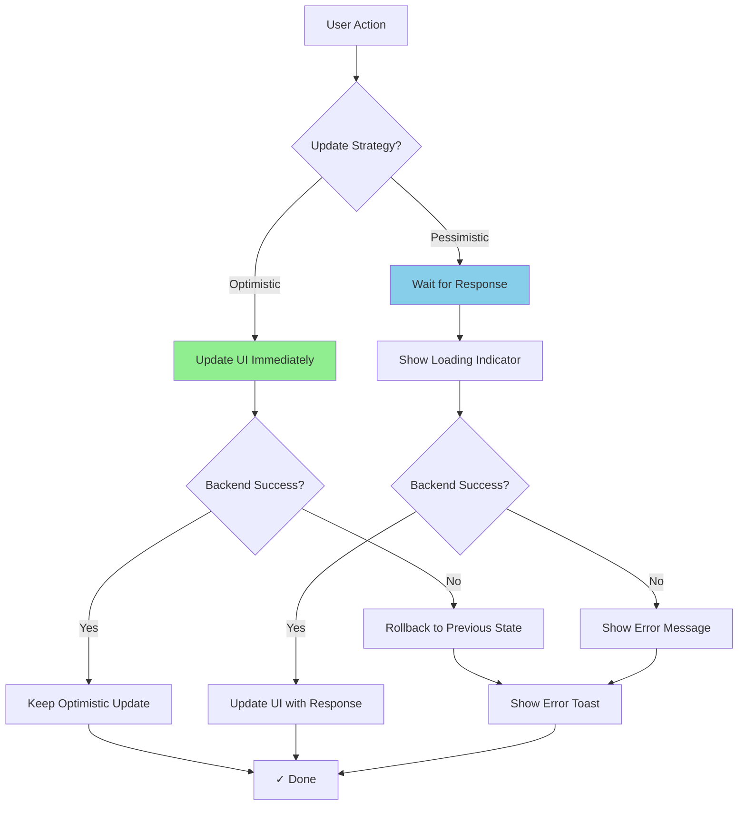

### When to Use Optimistic Updates

| Scenario | Use Optimistic? | Reason |
|----------|----------------|--------|
| Queue status toggle | ✅ Yes | Fast, user expects immediate feedback |
| Message deletion | ✅ Yes | Clear intent, can rollback |
| Suspend queue | ⚠️ Maybe | Critical operation, consider confirmation |
| Configuration changes | ❌ No | Complex validation, wait for server |
| User authentication | ❌ No | Security-critical, must verify |
| Bulk operations | ❌ No | High chance of partial failure |

---

## Offline Data Synchronization

### Offline Queue Architecture

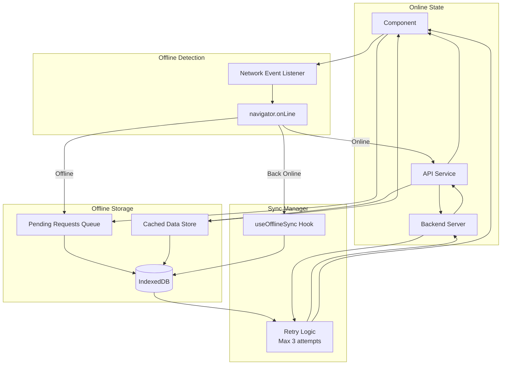

### Offline Sync Flow

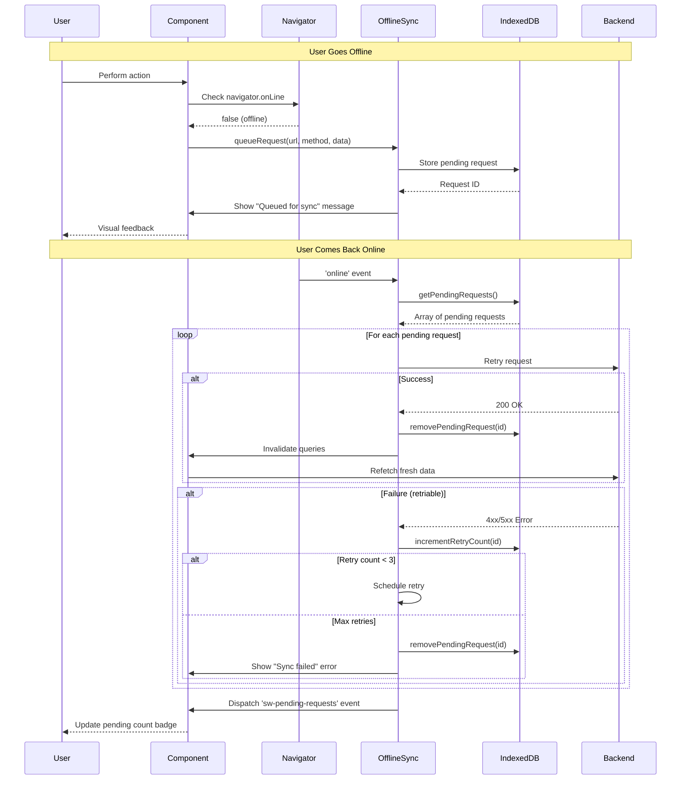

### Offline Sync Implementation

#### Queue Offline Request
```typescript
// useOfflineSync.ts - Line 77-110
const queueRequest = async (
  url: string,
  method: string,
  headers: Record<string, string> = {},
  body?: string
) => {
  const requestId = await offlineStorage.queueRequest({
    url,
    method,
    headers,
    body,
  });

  const pendingRequests = await offlineStorage.getPendingRequests();
  setSyncStatus((prev) => ({
    ...prev,
    pendingCount: pendingRequests.length,
  }));

  // Dispatch event for UI updates
  window.dispatchEvent(
    new CustomEvent('sw-pending-requests', {
      detail: { count: pendingRequests.length },
    })
  );

  return requestId;
};
```

#### Sync Pending Requests
```typescript
// useOfflineSync.ts - Line 19-76
const syncPendingRequests = async () => {
  if (!navigator.onLine) return;

  setSyncStatus((prev) => ({ ...prev, isSyncing: true }));

  const pendingRequests = await offlineStorage.getPendingRequests();

  for (const request of pendingRequests) {
    try {
      const response = await fetch(request.url, {
        method: request.method,
        headers: request.headers,
        body: request.body,
      });

      if (response.ok) {
        await offlineStorage.removePendingRequest(request.id);
      } else if (request.retryCount < 3) {
        await offlineStorage.incrementRetryCount(request.id);
      } else {
        // Max retries reached
        await offlineStorage.removePendingRequest(request.id);
      }
    } catch (error) {
      if (request.retryCount < 3) {
        await offlineStorage.incrementRetryCount(request.id);
      }
    }
  }

  setSyncStatus({
    isSyncing: false,
    pendingCount: remainingRequests.length,
    lastSyncTime: Date.now(),
    error: null,
  });
};
```

#### Listen for Online Event
```typescript
// useOfflineSync.ts - Line 112-137
useEffect(() => {
  // Sync when coming back online
  const handleOnline = () => {
    syncPendingRequests();
  };

  window.addEventListener('online', handleOnline);

  // Periodic cleanup
  const cleanupInterval = setInterval(() => {
    offlineStorage.cleanupExpired();
  }, 60 * 60 * 1000); // Every hour

  return () => {
    window.removeEventListener('online', handleOnline);
    clearInterval(cleanupInterval);
  };
}, []);
```

### IndexedDB Schema

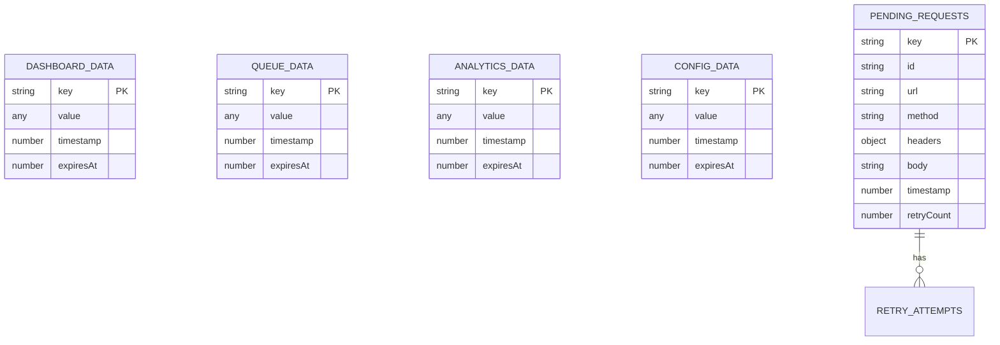

### Offline Indicator

```typescript
// OfflineIndicator.tsx - Shows when offline
const OfflineIndicator = () => {
  const [isOnline, setIsOnline] = useState(navigator.onLine);
  const [pendingCount, setPendingCount] = useState(0);

  useEffect(() => {
    const handleOnline = () => setIsOnline(true);
    const handleOffline = () => setIsOnline(false);

    const handlePendingCount = (e) => {
      setPendingCount(e.detail.count);
    };

    window.addEventListener('online', handleOnline);
    window.addEventListener('offline', handleOffline);
    window.addEventListener('sw-pending-requests', handlePendingCount);

    return () => {
      window.removeEventListener('online', handleOnline);
      window.removeEventListener('offline', handleOffline);
      window.removeEventListener('sw-pending-requests', handlePendingCount);
    };
  }, []);

  if (isOnline && pendingCount === 0) return null;

  return (
    <div className="offline-banner">
      {!isOnline && <span>You are offline</span>}
      {pendingCount > 0 && <span>{pendingCount} requests pending sync</span>}
    </div>
  );
};
```

---

## Summary

### Data Flow Best Practices

1. **Cache First**: Always check cache before fetching
2. **Optimistic Updates**: Use for fast, user-facing operations
3. **Error Handling**: Graceful degradation at every layer
4. **Retry Logic**: Exponential backoff for transient errors
5. **Offline Support**: Queue requests when offline, sync when online
6. **Cache Invalidation**: Invalidate related queries after mutations
7. **Type Safety**: TypeScript for request/response contracts

### Performance Optimizations

- **Debounced Search**: 300ms delay to reduce API calls
- **Smart Caching**: 5s stale time, 5min cache time
- **Lazy Queries**: Enabled only when needed
- **Background Refetch**: Stale-while-revalidate pattern
- **Request Deduplication**: TanStack Query prevents duplicate requests

### Security Considerations

- **Auth Token Injection**: Automatic via interceptors
- **CSRF Protection**: Token in request headers
- **401 Auto-Logout**: Immediate redirect to login
- **Error Sanitization**: Don't expose sensitive data in errors
